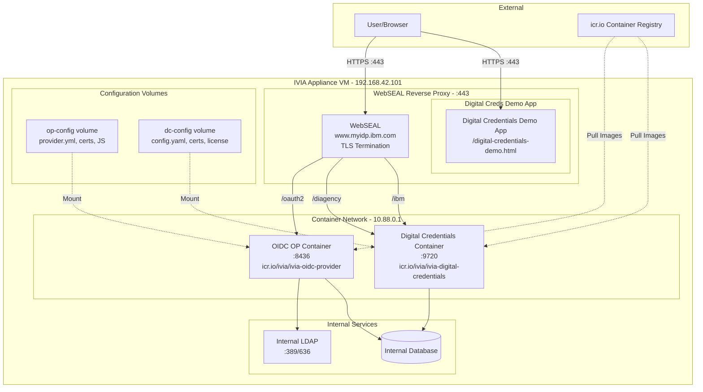

# Deploying the Digital Credentials Cookbook
This example demonstrates how IBM Verify Identity Access can be used to issue and verify digital credentials to employees/users.

This deployment will use the IBM Verify Identity Access appliance platform to host the Digital Credentials and OIDC OP containers.

The following configuration guide assumes a familiarity with IVIA architecture and components.

## Table of Contents
- [Prerequisites](#prerequisites)
- [Architecture](#architecture)
- [Generate PKI](#generate-pki)
  - [CA Certificate](#ca-certificate)
  - [icr.io Certificate](#icrio-certificate)
  - [Internal LDAP Certificate](#internal-ldap-certificate)
  - [WebSEAL Reverse Proxy](#webseal-reverse-proxy)
  - [Digital Credential Service](#digital-credential-service)
  - [OIDC OP Service](#oidc-op-service)
- [Create Configuration Archives](#create-configuration-archives-for-op-and-dc-containers)
- [Configure IVIA Appliance](#configure-the-ibm-verify-identity-access-appliance)
- [Testing](#testing-the-igital-redentials-apabilities)
- [Next Steps](#next-steps)
- [Additional Resources](#additional-resources)
- [Troubleshooting](#troubleshooting)

## Prerequisites

- IBM Verify Digital Credentials License
- IBM Verify Identity Access License
- Deploy IVIA (appliance) and activate the WebSEAL, Digital Credentials and Federation modules
  - This example requires IVIA v11.0.1.0 and newer
- Configure the WebSEAL runtime environment (user registry and policy server)
  - This demo assumes that you are using the internal LDAP registry provided by the appliance.
- `zip` and `openssl` command line tools

> [!WARNING]
> **Security Considerations**
> - This demo uses weak passwords (`Passw0rd`, `secret`) for simplicity
> - In production, use strong, unique passwords
> - Store secrets in secure vaults (e.g., Kubernetes Secrets, HashiCorp Vault)
> - Implement certificate rotation policies
> - Enable audit logging
> - Follow principle of least privilege

## Architecture

The following diagram shows the architecture of the deployment. The deployment uses a IBM Verify Identity Access appliance to host the Digital Credentials and OIDC OP containers. The WebSEAL reverse proxy is used to route relevant requests to the Digital Credentials and OIDC OP containers.



This deployment consists of three main components:
- **WebSEAL Reverse Proxy**: Front-end gateway handling TLS termination
- **OIDC OP Container**: OAuth2/OIDC provider for authentication
- **Digital Credentials Container**: Issues and verifies digital credentials

The demonstration app available at https://www.myidp.ibm.com/digital-credentials-demo.html is used to demonstrate the issuance and verification of digital credentials. This sample application relies on the OIDC client credentials set the in `provider.yml` file of the OIDC OP container, and should normally be secret/obsfuscated.


# Generate PKI
The services used for this deployment all need certificates and keys to secure communications. They also need to be able to establish trust with each other. To achieve this we will use a mock Certificate Authority (CA) which will issue certificates for the reverse proxy, OIDC OP service, and the Digital Credential service. 

The following sections describe how to generate the required PKI artifacts; and add the required X509 extensions to each of the certificates issued to each service.

## CA Certificate
The mock Certificate Authority will be used to issue certificates for the reverse proxy, OIDC OP service, and the Digital Credential service. This section describes how to generate the required PKI artifacts; and add the Basic Constraints and Key Usage X509 extensions.

> [!Note] The private key is encrypted with a simple password, this should be changed in your environment

```bash
mkdir pki
# Generate self signed certificate + key with Key Usage extension
openssl req -x509 -subj "/C=AU/O=IBM/OU=Security/CN=ivia.ca" -newkey rsa:2048 -keyout pki/ivia-ca.key -out pki/ivia-ca.pem -passout pass:Passw0rd -days 365 -addext extendedKeyUsage=serverAuth,clientAuth -addext keyUsage=keyCertSign,cRLSign -addext "basicConstraints=critical,CA:TRUE"
# Wrap key and X509 in PKCS12 container
openssl pkcs12 -export -out pki/ivia-ca.p12 -inkey pki/ivia-ca.key -in pki/ivia-ca.pem -passout pass:Passw0rd -passin pass:Passw0rd
```

## icr.io Certificate
The latest icr.io certificate will need to be read from the server endpoint. This can be done with the `openssl`, `echo` and `sed` commands.

```bash
# Export icr.io registry cert
echo -e '\n' | openssl s_client -connect icr.io:443 | sed --quiet '/-BEGIN CERTIFICATE-/,/-END CERTIFICATE-/p' > pki/icr.io.pem

```

## Internal LDAP Certificate
The internal LDAP certificate will need to be read from the server endpoint. This can be done with the `openssl`, `echo` and `sed` commands. You will need to update the `192.168.42.101` IP address to match your environment.

```bash
# Export self-signed LDAP cert
echo -e '\n' | openssl s_client -connect 192.168.42.101:636 | sed --quiet '/-BEGIN CERTIFICATE-/,/-END CERTIFICATE-/p' > pki/ldap.pem
```

## WebSEAL Reverse Proxy
The reverse proxy requires the Subject Alt Name and Key Usage X509 extensions.

> [!Note] The private key is encrypted with a simple password, this should be changed in your environment

```bash
cat > pki/webseal.v3.ext << EOF
authorityKeyIdentifier=keyid,issuer
basicConstraints=CA:FALSE
keyUsage = digitalSignature, nonRepudiation, keyEncipherment, dataEncipherment
subjectAltName = @alt_names
[alt_names]
DNS.1 = www.myidp.ibm.com
IP.1 = 192.168.42.101
EOF
openssl req -new -out pki/webseal.csr -passout pass:Passw0rd -newkey rsa:4096 -keyout pki/webseal.key -subj "/C=AU/O=IBM/OU=Security/CN=my.idp"
openssl x509 -req -in pki/webseal.csr -CA pki/ivia-ca.pem -CAkey pki/ivia-ca.key -CAcreateserial -out pki/webseal.pem -days 9999 -sha256 -extfile pki/webseal.v3.ext -passin pass:Passw0rd
openssl pkcs12 -export -out pki/webseal.p12 -inkey pki/webseal.key -in pki/webseal.pem -passout pass:Passw0rd -passin pass:Passw0rd
rm -f pki/webseal.v3.ext pki/webseal.v3.csr
```

## Digital Credential Service
The Digital Credentials service requires the Subject Alt Name X509 extension. The Digital Credential container also requires a private key for signing the nonce.

> [!Note] The private key is encrypted with a simple password, this should be changed in your environment

```bash
cat > pki/dc.v3.ext <<EOF
[req]
distinguished_name = req_distinguished_name
x509_extensions = v3_req
prompt = no

[req_distinguished_name]
CN = iviadc

[v3_req]
subjectKeyIdentifier = hash
authorityKeyIdentifier = keyid:always
basicConstraints = CA:FALSE
keyUsage = digitalSignature, nonRepudiation, keyEncipherment, dataEncipherment
subjectAltName = @alt_names

[ alt_names ]
DNS.1 = iviadc
EOF
openssl req -new -nodes -keyout pki/ivia-dc.key -out pki/ivia-dc.csr -config pki/dc.v3.ext
openssl x509 -req -in pki/ivia-dc.csr -CA pki/ivia-ca.pem -CAkey pki/ivia-ca.key -CAcreateserial -out pki/ivia-dc.pem -days 9999 -extensions v3_req -extfile pki/dc.v3.ext -passin pass:Passw0rd
rm -rf pki/dc.v3.ext
openssl ecparam -name prime256v1 -genkey -noout -out pki/oid4vci_nonce_private_key.pem
```

## OIDC OP Service
The OIDC OP service requires the Subject Alt Name X509 extension.

> [!Note] The private key is encrypted with a simple password, this should be changed in your environment

```bash
cat > pki/op.v3.ext <<EOF
[req]
distinguished_name = req_distinguished_name
x509_extensions = v3_req
prompt = no

[req_distinguished_name]
CN = iviadcop

[v3_req]
keyUsage = keyEncipherment, dataEncipherment
extendedKeyUsage = serverAuth
subjectAltName = @alt_names

[alt_names]
DNS.1 = iviadcop
EOF
openssl req -new -nodes -keyout pki/ivia-op.key -out pki/ivia-op.csr -config pki/op.v3.ext
openssl x509 -req -in pki/ivia-op.csr -CA pki/ivia-ca.pem -CAkey pki/ivia-ca.key -CAcreateserial -out pki/ivia-op.pem -days 9999 -extensions v3_req -extfile pki/op.v3.ext -passin pass:Passw0rd
```

# Create Configuration Archives for OP and DC containers
To run the OIDC OP and Digital Credentials containers on an IVIA appliance, the configuration files + additional JavaScript, PKI, etc. needs to be uploaded to a volume. This volume is then mounted to the container's file system when the container starts.

For the OIDC OP container you will need:
- `ldap.pem`: X509 certificate for (internal appliance) LDAP service
- `ivia-ca.pem`: X509 mock CA certificate
- `ivia-op.{pem,key}`: X509 certificate and private key for OIDC OP service
- `provider.yml`: Defines OIDC endpoints, client configurations, and token settings
- `pretoken.js`: Mapping rule executed before token generation to add custom claims
- `preauth_notifytxcode.js`: Handles transaction notification flows
- `preauth_userauth.js`: Custom user authentication logic
- `ropc.js`: Resource Owner Password Credentials flow handler

**PKI Requirements:**
- Files in `keystore/` directory are used for TLS server certificates
- CA certificates enable trust validation between services

For the Digital Credential container you will need:
- `ivia-ca.pem`: X509 mock CA certificate
- `ivia-dc.{pem,key}`: X509 certificate and private key for Digital Credentials service
- `config.yaml`: Configuration file for Digital Credentials container
- `license.txt`: License file for Digital Credentials container

> [!NOTE] There are a number of hard-coded host names and secrets in these configuration files. These properties
           will need to be updated to match your environment. The configuration files are provided as examples only.

## Zip Configuration Archives
To create the archive (zip) files, change to the directory containing the configuration files and add the required files to the archive. You will need to collect the required PKI files from the `pki/` directory first:

### Prepare Files
First, copy the required PKI files to the configuration directories:

```bash
# Verify PKI files exist
ls -la pki/*.{pem,key,p12}

# Copy to OP configuration directory
cp pki/ldap.pem op_config/
cp pki/ivia-ca.pem op_config/
cp pki/ivia-op.{pem,key} op_config/keystore/

# Copy to DC configuration directory
cp pki/ivia-ca.pem dc_config/
cp pki/ivia-dc.{pem,key} dc_config/
cp pki/oid4vci_nonce_private_key.pem dc_config/
```

### Create Archives
```bash
cd op_config
zip -r op-config.zip keystore ldap.pem ivia-ca.pem provider.yml pretoken.js preauth_notifytxcode.js preauth_userauth.js ropc.js
cd ../dc_config
zip -r dc-config.zip ivia-ca.pem ivia-dc.pem ivia-dc.key oid4vci_nonce_private_key.pem config.yaml license.txt
cd ..
```

### Verify Archives
```bash
# Check OP archive contents
unzip -l op_config/op-config.zip

# Check DC archive contents
unzip -l dc_config/dc-config.zip
```

# Configure the IBM Verify Identity Access Appliance
Update the environment variables with values required for your deployment. Make sure you have copies of the required LUA http transformation rules, extension files for the OP and DC containers; and the PKI files for the mock CA and the Reverse Proxy PKCS12 (certificate and key for TLS connections to WebSEAL).

The IVIA extensions for the DC and OP containers can be downloaded from the [IBM App Xchange](https://apps.xforce.ibmcloud.com/). These extensions are required to run the Digital Credential and OIDC OP containers on the IVIA appliance.

You will also need to get a copy of the X509 certificate used to verify connections to `icr.io` or the container registry that you will be using to fetch the OP and DC containers from.

> [!NOTE] This certificate changes relatively frequently.

This demo assumes you will be able to use the domain name `www.myidp.ibm.com` for the reverse proxy interface of the IVIA appliance. If you are using different domain names, you will need to update the configuration files accordingly. 

Typically this is done by using the `hosts` file in your operating system. For example, on Linux or MacOS, you can add the following lines to the `/etc/hosts` file; or for Windows modify the `C:\Windows\System32\drivers\etc\hosts` file:
```
192.168.42.101 lmi.myidp.ibm.com
192.168.42.102 www.myidp.ibm.com
```
The IP addresses are the IP addresses of the IVIA appliance and the reverse proxy respectively. You will need to update these IP addresses to match the IP addresses of your IVIA appliance and reverse proxy.

This example makes use of the internal LDAP registry and Database services of the IVIA appliance. If you are using an external LDAP registry or Database service, you will need to update configuration files in both IVIA and the hosted containers accordingly.

Run the automated configuration tool to configure the IBM Verify Identity Access Appliance:

```bash
# source dc.env # Update hard coded secrets with values required for your deployment
cp pki/icr.io.pem .
cp pki/webseal.p12 .
cp pki/ivia-ca.pem .
export IVIA_CONFIG_BASE="$(pwd)"
export IVIA_MGMT_USER="admin"
export IVIA_MGMT_PWD="admin"
export IVIA_CONFIG_YAML=digital_cred_demo.yaml
export IVIA_MGMT_BASE_URL=https://lmi.myidp.ibm.com
export WRP_ADDRESS="192.168.42.102"
python3 -m ibmvia_autoconf | tee dc_demo.log
```
> [!IMPORTANT]
> This guide uses example values that MUST be changed for your environment:
> - Domain: `www.myidp.ibm.com` → Replace with your domain
> - LMI IP: `192.168.42.101` → Your appliance management IP
> - WebSEAL IP: `192.168.42.102` → Your reverse proxy IP
> - Passwords: `Passw0rd` → Use strong passwords in production


# Testing the Digital Credentials Capabilities

The sample Digital Credential single page application is available at https://www.myidp.ibm.com/digital-credentials-demo. You can use this application to test the Digital Credentials capabilities of the IBM Verify Identity Access Appliance. You will need to enter the client credentials for the admin, issuer, and verifier clients; in addition to a user (holder) who will be issued a digital credential.


# Next Steps

After successful deployment:

1. **Configure Digital Credential Templates**
   - Define credential schemas
   - Set up issuance policies
   - Configure verification rules
   - A sample app is available at `https://www.myidp.ibm.com/digital-credentials-demo.html` to test the issuance and verification workflows of the Digital Credentials container

2. **Integrate with Applications**
   - Review API documentation at `https://www.myidp.ibm.com/ibm/api/explorer`
   - Implement credential request flows
   - Set up verification endpoints

3. **Security Hardening**
   - Replace default passwords
   - Configure certificate rotation
   - Enable audit logging
   - Review security best practices

4. **Monitoring**
   - Set up health checks
   - Configure alerting
   - Review logs regularly

# Additional Resources

- [IBM Verify Digital Credentials Documentation](https://www.ibm.com/docs/en/verify-digital-credentials)
- [IBM Verify Identity Access Documentation](https://www.ibm.com/docs/en/sva)
- [OpenID for Verifiable Credentials](https://openid.net/specs/openid-4-verifiable-credential-issuance-1_0.html)

# Troubleshooting

## Common Issues

**Issue:** Container fails to start
- Check logs: `docker logs <container-name>`
- Verify PKI files are correctly mounted
- Ensure environment variables are set

**Issue:** Certificate validation errors
- Verify CA certificate is trusted
- Check certificate SAN entries match hostnames